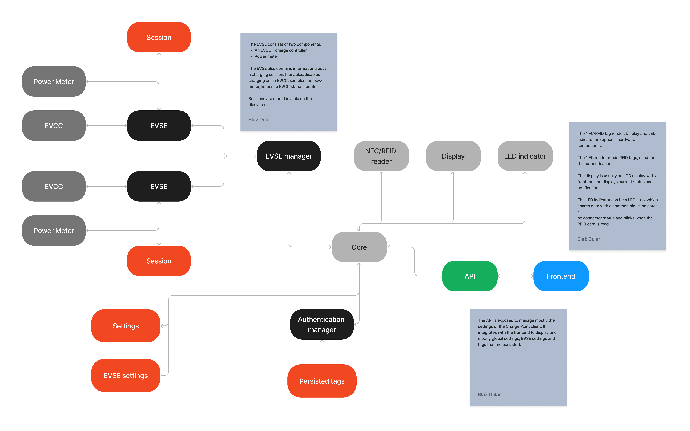

# Architecture and design

## Core

## Authentication manager

### Authentication cache

### Local Authentication List

## EVSE Manager

### EVSE

### EVCC

### Power Meter

## Session

## Diagnostics

## Hardware

### Display

### Reader

### Indicator

## API

## Settings management 