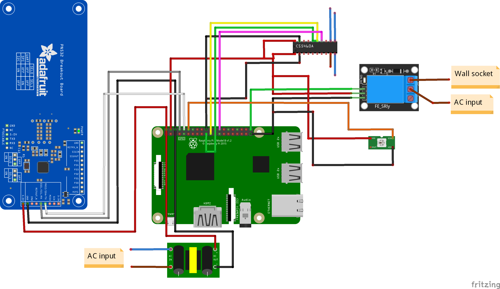

# Supported hardware and schematics

The hardware, such as Reader, Indicator and a Display must be configured in [_settings
file_](../../configs/settings.json), and EVSEs should be configured in the [_evses folder_](../../configs/evses), each
in a separate file.

If you want to add support for any type of hardware, read
the [contribution guide](../contribution/adding-support-for-hardware.md).

## RFID/NFC readers

### Supported or tested readers

| Reader | Is supported | 
|:------:|:------------:|
| PN532  |      ✔       |

#### PN532

The PN532 reader can communicate through UART/I2C/SPI. The client uses the NFC go library, which is a wrapper for libnfc
1.8.0 (and above). You could use any other libnfc compatible NFC/RFID reader, but the configuration steps as well as
wiring could vary.

The pinout will also vary depending on your preferred communication protocol. This pinout is used for UART.

| RPI PIN | PN532 PIN | 
|:-------:|:---------:|
|   5V    |    VCC    |
|   GND   |    GND    | 
| GPIO 14 |    TX     |
| GPIO 15 |    RX     | 

## Displays

### Supported displays

| Display | Is supported | 
|:-------:|:------------:|
| HD44780 |      ✔       |

#### HD44780

The HD44780 LCD should be on I2C bus 1 with an address equal to 0x27. To find the I2C address, follow these steps:

1. Download i2c tools:

   ```bash
   sudo apt-get install -y i2c-tools
   ```

2. Enable I2C interface and if needed, reboot.

3. Run the following command to get the I2C address:

   ```bash
   sudo i2cdetect -y 1 
   ```

|       RPI PIN        | PCF8574 PIN | 
|:--------------------:|:-----------:|
|   2 or any 5V pin    |     VCC     |
| 14 or any ground pin |     GND     | 
|      3 (GPIO 2)      |     SDA     |
|      5 (GPIO 3)      |     SCL     | 

## EVCC

EV charging controller (EVCC) controls the communication with the EV and allows or denies the charging. It can also set
the charging current limit.

|         EVCC          | Is supported | 
|:---------------------:|:------------:|
|         Relay         |      ✔       |
| Phoenix Contact EVSEs |   Planned    |

### Relay (or relay module)

There are multiple relay options that could be used for the charging station, such as Solid state relays, contactors,
etc. Choose your option according to your needs. Be very careful with the options and consult a professional, as it may
become electrical and fire hazard.

It is highly recommended splitting both GND and VCC between relays or using a relay module.

| RPI PIN                           | RELAY PIN | 
|-----------------------------------|:---------:|
| 4 or any 5V pin                   |    VCC    | 
| 20 or any ground pin              |    GND    |  
| 37 (GPIO 26) or any free GPIO pin | S/Enable  |  

## Power meter

### Supported power meters

| Power meter | Is supported | 
|:-----------:|:------------:|
|   CS5460A   |      ✔       |
|     ETI     |   Planned    |

#### CS5460A

|       RPI PIN        | CS5460A PIN |  
|:--------------------:|:-----------:|
|        4 or 2        |     VCC     | 
| 25 or any ground pin |     GND     | 
|     Any free pin     |    CE/CS    |   
|     40 (GPIO 21)     |     SCK     |    
|     38 (GPIO 20)     |    MOSI     |    
|     35 (GPIO 19)     |    MISO     |  

## Indicators

### Supported LED indicators

| Indicator | Is supported | 
|:---------:|:------------:|
|  WS2812b  |      ✔       |
|  WS2811   |      ✔       |

#### WS2811 and WS2812b

The WS281x LED strip comes in multiple voltage variants. It is recommended to use the 5V variant, since the Raspberry Pi
provides the 5V for power instead of using an external power supply.

|   RPI PIN    | WS281x PIN |  
|:------------:|:----------:|
|  Any 5V pin  |    VCC     | 
| Any GND pin  |    GND     |   
| 32 (GPIO 12) |    Data    |

## Wiring diagram

